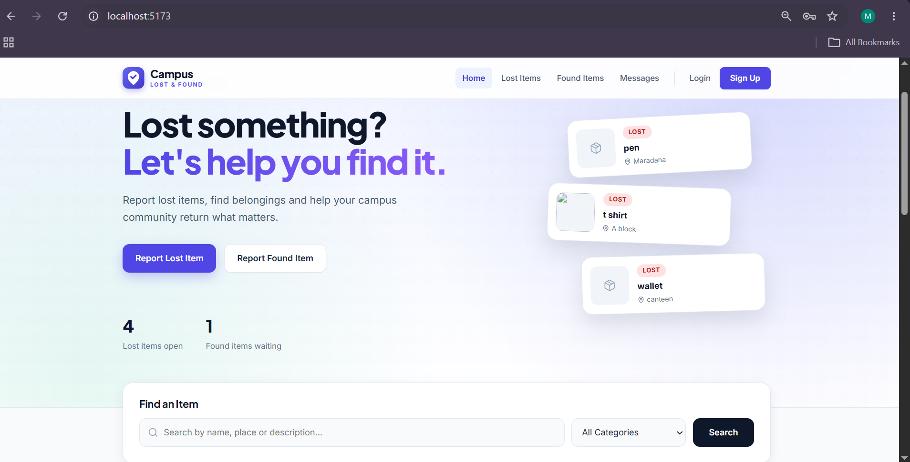
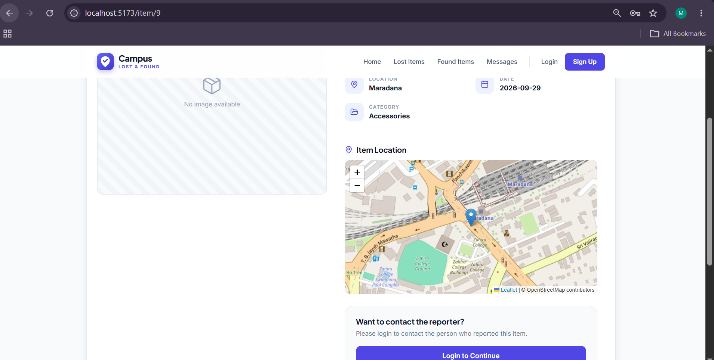
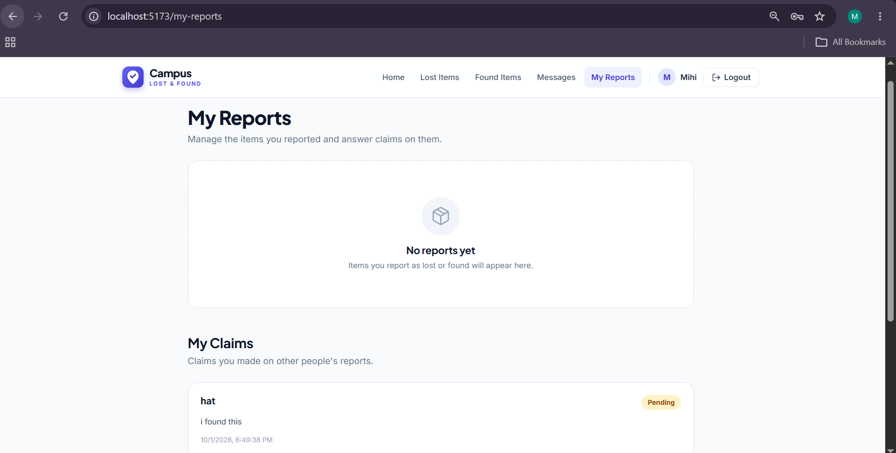
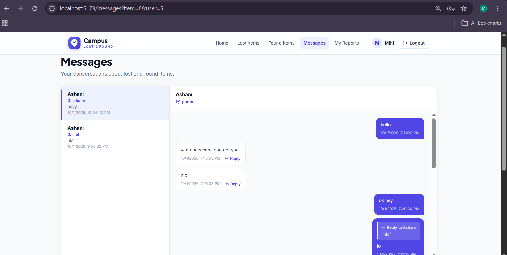

<div align="center">

# 📍 Campus Lost & Found

### Helping students and staff get lost items back, faster

A full-stack web app where people can report lost and found items on campus, pin the exact spot on a map, message each other privately, and claim items so they get back to their owners.


</div>

---

## 📖 About the Project

On most campuses, lost items are tracked through notice boards and "has anyone seen my…" messages in group chats. Items get missed, and owners never find out that someone picked up their phone or ID card.

**Campus Lost & Found** puts everything in one place. Someone who loses an item posts a *lost* report; someone who finds one posts a *found* report. Others can browse and search reports, see on a map exactly where the item was lost or found, contact the reporter privately, and make a claim. The reporter accepts or rejects the claim, and the item is marked as returned.

---

## 🎬 Demo Video

<!-- Drag your demo video here in the GitHub editor -->

---

## ✨ Features

### 👤 Accounts
- Register, **verify email**, log in and log out
- **Forgot password** flow with a one-time reset link
- Strong password rules checked on both frontend and backend

### 📝 Reports
- Report a **lost** or **found** item with title, category, location, date, description and an optional photo
- **Drop a pin on the map** to mark the exact location (Leaflet + OpenStreetMap)
- Edit, delete, or mark your reports as **returned** from *My Reports*

### 🔎 Browse & Search
- Separate **Lost Items** and **Found Items** lists, newest first
- Search on the home page by keyword and category
- Item details page with photo, map location and status labels

### 💬 Messaging
- Private **conversations** about each item, grouped like a chat inbox
- **Unread message badge** in the navbar (auto-refreshes)
- Reply to a specific message with quoting

### ✅ Claims
- *"I Found This Item"* on lost reports, *"This Is My Item"* on found reports
- Reporter **accepts or rejects** claims; accepting marks the item as returned
- Claimants are notified in their inbox and can track all their claims

### 🛡️ Admin Panel
- Manage **all reports**: edit, close/reopen or delete
- Manage **users**: give or remove the admin role

---

## 📸 Screenshots

| Home Page | Item Details |
|:---:|:---:|
|  |  |

| Report an Item | Inbox |
|:---:|:---:|
|  |  |

---

## 🛠️ Tech Stack

| Layer | Technology |
|---|---|
| **Frontend** | React 19, Vite, React Router, Lucide icons |
| **Maps** | Leaflet / React Leaflet with OpenStreetMap tiles (no API key needed) |
| **Backend** | PHP 8 (REST-style API endpoints, PDO) |
| **Database** | PostgreSQL |
| **Auth** | PHP sessions with secure cookies |

---

## 🏗️ System Architecture

```
 Browser (React app)            PHP API                  PostgreSQL
 http://localhost:5173   -->    http://localhost:8000    -->   campusLostFound
 frontend/                      backend/api/                   database
                                backend/uploads/  (item photos)
```

Every API response has the same JSON shape: a `success` flag, a `message` when something should be shown to the user, and the requested data.

### 🗄️ Database Tables

| Table | Purpose |
|---|---|
| `users` | Accounts, roles (`student` / `admin`), email verification |
| `categories` | Item categories (Electronics, Documents, Accessories, Books, Other) |
| `items` | Lost and found reports with map coordinates and status |
| `messages` | Private messages between users about an item |
| `claims` | Claims on items (`pending` / `accepted` / `rejected`) |
| `user_tokens` | Hashed one-time tokens for email verification and password reset |

---

## 📁 Project Structure

```
campusLostFound/
├── backend/
│   ├── api/              # PHP API endpoints (one file per endpoint)
│   ├── config/           # DB connection, sessions, CORS, helpers
│   ├── uploads/          # Uploaded item photos
│   ├── migrate.php       # Applies database migrations
│   └── make-admin.php    # Makes a user an admin
├── database/
│   ├── schema.sql        # Full schema for a new install
│   └── migrations/       # Changes for an existing database
├── docx/
│   └── documentation.md  # Detailed project documentation
└── frontend/
    └── src/
        ├── components/   # Navbar, Footer, Logo, ItemCard
        ├── pages/        # One file per page
        ├── api.js        # API helpers
        └── App.jsx       # Routes
```

---

## 🚀 Getting Started

### Prerequisites
- [Node.js](https://nodejs.org/) and npm
- [PHP](https://www.php.net/) 8+ with `pdo_pgsql`, `fileinfo` and `mbstring` enabled
- [PostgreSQL](https://www.postgresql.org/)

### 1. Clone the repository
```bash
git clone https://github.com/Mihiniii/campusLostFound.git
cd campusLostFound
```

### 2. Set up the database
```bash
createdb -U postgres campusLostFound
psql -U postgres -d campusLostFound -f database/schema.sql
```

### 3. Configure and start the backend
```bash
cp backend/config/config.example.php backend/config/config.local.php
# Open config.local.php and add your PostgreSQL username and password

php -S localhost:8000 -t backend
```
Check the connection at **http://localhost:8000/test-db.php**

### 4. Start the frontend
```bash
cd frontend
npm install
npm run dev
```
Open **http://localhost:5173** 🎉

### 5. Create an admin (optional)
Register on the website first, then run:
```bash
php backend/make-admin.php your-email@example.com
```

> 📧 In development, emails aren't actually sent. They're written to `storage/mail.log`, and the site offers to open the link directly so you can still test verification and password reset.

---

## 🔒 Security Highlights

- Passwords are **hashed**; never stored or returned in plain text
- **Login rate limiting**: blocked after 5 wrong attempts in 15 minutes
- Verification and reset tokens are **single-use, time-limited and stored only as hashes**
- Forgot-password gives the same response for any email, so it **can't be used to discover accounts**
- The logged-in user is always read from the **server session**, not from the browser
- Admin role is **checked in the database on every admin request**
- Photo uploads are validated by **real file type and size** (max 5 MB) and saved with random names
- **CORS** limited to the frontend's origin; database credentials kept out of git

---

## 📚 Documentation

Full details on how each feature works, the data model, and where everything lives in the code: **[docx/documentation.md](docx/documentation.md)**

---

## 🗺️ Future Improvements

- [ ] Email notifications for new messages and claims
- [ ] Server-side search and filters by date and location
- [ ] Real-time chat with WebSockets
- [ ] Mobile app version
- [ ] Deploy a live demo

---

## 👩‍💻 Author

**Mihini Weerasekara**
Final-year Computer Science undergraduate, Uva Wellassa University of Sri Lanka

[](https://github.com/Mihiniii)
[](https://linkedin.com/in/your-profile)

---

<div align="center">
⭐ If you like this project, give it a star!
</div>